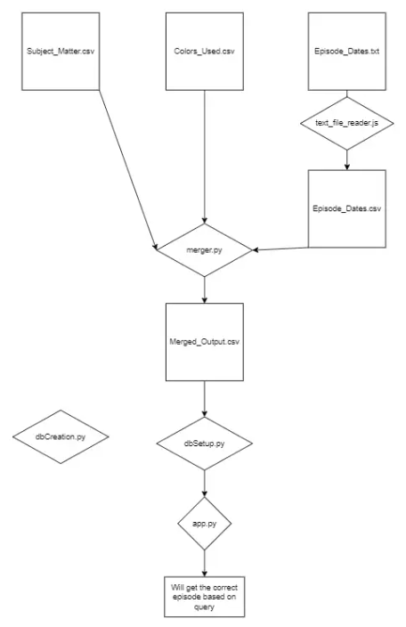

# The Joy of Painting Data API

## Overview

This project is designed to build an API and database to facilitate querying and filtering episodes of "The Joy of Painting" based on various criteria. The goal is to consolidate data from multiple sources, transform it into a unified format, and provide a robust API for users to explore episodes by broadcast month, subject matter, and colors.

## Motivation

This project aims to centralize and streamline episode data, enabling a comprehensive and user-friendly way to access and filter the content. By creating a database and API, we can make this data easily accessible for viewers through a web interface.

## ETL Flowchart



## Tech/Framework Used

- **JavaScript**: Transform given txt file into csv
- **MySQL**: Database system to store and manage episode data.
- **Flask**: Framework for building the API.
- **Python**: Programming language used for scripting and API development.
- **CSV**: Data format for input data files.

## Features

- **Filtering by Broadcast Month**: View episodes based on the month they originally aired.
- **Subject Matter Filtering**: Find episodes featuring specific subjects.
- **Color Palette Filtering**: Explore episodes based on the colors used in the painting.
- **Multiple Filter Support**: Apply multiple filters simultaneously intersecting of filter criteria.

## Installation and How to Use

Prior to running any provided code make sure you have Python3, Pip3, Node, and MySQL installed.

Start by install nessasary python libraries.

```
pip3 install -r requirements.txt
```

Next convert Episode_Dates.txt in a csv,

```
python3 text_file_reader.txt
```

Now to merge the csv files.
```
python3 merger.py
```

Make sure mysql database is running with
```
sudo service mysql status
```

If mysql is not running.
```
sudo service mysql start
```

If mysql needs to be stopped.
```
sudo service mysql stop
```

Time to create the Database.
```
python3 dbCreation.py
```

Now that the csv file are merged and mysql database is running, run this to create the tables and upload the data.

```
python3 dbSetup.py
```

Note: this is database does not require a password, if your database does require a password please alter to match your password.

These are found in app.py and dbSetup.py and a variation in dbCreation.py

```python
db_config = {
    'host': '127.0.0.1',
    'user': 'root',
    'password': 'your_password',
    'database': 'JoyOfPaintingDB'
}
```

Finally run this code and begin testing

```
python3 app.py
```

## Testing

Here's an example of how to filter episodes by colors using the API in terminal and postman:

```
curl "http://localhost:5000/episodes?colors=Bright_Red,cADMIUM_Yellow,Sapgreen"
```

You can use similar inputs for subject, month or a combination of all three in any order:
```
curl "http://localhost:5000/episodes?month=januarY&colors=Bright_Red,cADMIUM_Yellow,Sapgreen&subjects=BUSHES,RiveR,grass"
```

To test in postman simple remove the curl and double quotes

## Author

- **Lee West** : [LeeWest89](https://github.com/LeeWest89)

## Connect with me

- [LinkedIn](https://www.linkedin.com/in/lee-a-west/)